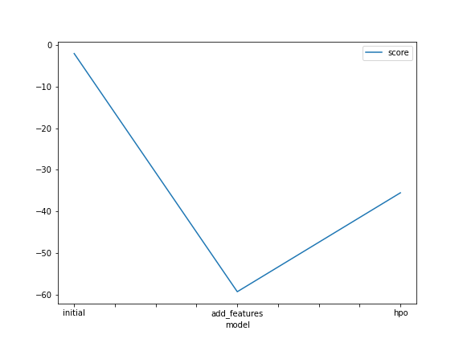
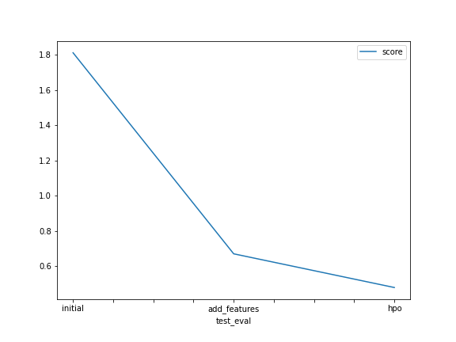

# Report: Predict Bike Sharing Demand with AutoGluon Solution
#### Ankush Katiyar

## Initial Training
### What did you realize when you tried to submit your predictions? What changes were needed to the output of the predictor to submit your results?
The output of the predictor was a pandas series which contained the count values for the test data used for predictions. These values were inserted in the count columns of the submissions table, which was generated using sampleSubmissions.csv file. Before inserting values, the series was checked to find negative values, which was then replaced with 0. The submission table was converted into a csv file before submitting it to kaggle. 

### What was the top ranked model that performed?
The top ranking model in terms of performance was 'WeightedEnsemble_L3' and 'LightGBM_BAG_L2'. Both of them had same score_val(s) during hpo run.

## Exploratory data analysis and feature creation
### What did the exploratory analysis find and how did you add additional features?
The important findings was the relationship of count value with the hour of the day, which showed increase in count at certain times of day. To add the hour feature, first the datetime column was parsed and the hour data was extracted from it. I also added month and year columns using the same process but they didn't provide any improvement in the final model.

### How much better did your model preform after adding additional features and why do you think that is?
Before adding additional features, the model scored 1.81148 on kaggle, while after adding hour column, the model show much improvement with a score of 0.66949. After which I tried adding year and month columns. I made several training runs using different features, where I managed to get the best score of 0.51720 while using year and month features. The additional features made the model more accurate, in predicting the count of people for the given data.   

## Hyper parameter tuning
### How much better did your model preform after trying different hyper parameters?
After hyperparameter tuning, I was able to get a better score of 0.46396 on kaggle. 

### If you were given more time with this dataset, where do you think you would spend more time?
Given more time with the datasets, I would spend more time tuning hyperparameters, and observing their impact on overall accuracy of the model. I tried different hyperparameters during hpo, where I got varying results, and I still lack the understanding of how other hyperparameters beyond the ones I used, impact model's performance. 

### Create a table with the models you ran, the hyperparameters modified, and the kaggle score.
|model|time_limit|learning_rate|num_iterations|score|
|--|--|--|--|--|
|initial|600|0.1|100|1.81148|
|add_features|600|0.1|100|0.51720|
|hpo|900|0.05|200|0.46936|

### Create a line plot showing the top model score for the three (or more) training runs during the project.

### Create a line plot showing the top kaggle score for the three (or more) prediction submissions during the project.

## Summary
During this project we used AutoGluon's Tabular Predictor to make predictions on Kaggle's dataset provided in bike-sharing-demand competition. In this, we first made a raw submission, based on using raw data provided in train.csv file provided from kaggle, without creating any additional features, and relying on default hyperparameters. This resulted in a score of 1.81148 on kaggle. In the next step we had to do exploratory analysis, to add additonal features to the dataset. For this I parsed the datetime data provided in dataset to extract hour and month data, which had some relationship with the count of people which we were trying to predict. I also tried some other features but they didn't provide the expected outcome. Using month and hour as additional features, resulted in a score of 0.51720 on kaggle. I noticed the top performing models in this run was WeightedEnsemble models, followed by CatBoost and LightGBM. During hyperparameter optimization, I increased the time_limit to increase the training time for the model. I tried different hyperparameters on CatBoost and LightGBM models which included learning_rate, num_iterations, max_depth or depth and num_leaves. For the most time, I got scores around the score I got when I added additional features. Eventually I settled on tuning learning_rate and num_iterations for LightGBM model. I also dropped month column, because I was getting really poor score_val for the model during training, and I also thought that month didn't impact the count much. Doing this, the best score that I was able to achieve on kaggle was 0.46936 by adjusting, time_limit to 900s from 600s, learning rate to 0.05 from 0.1 and num_iterations to 200 from 100. 
